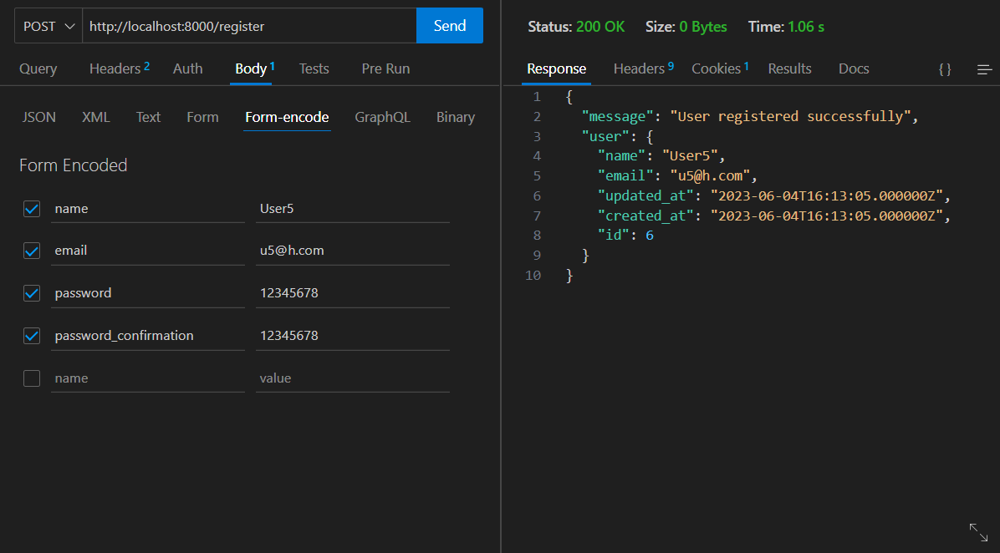
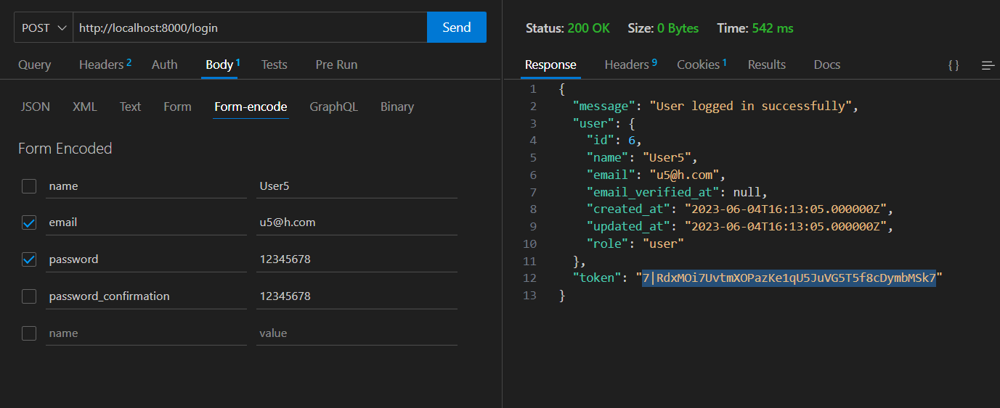
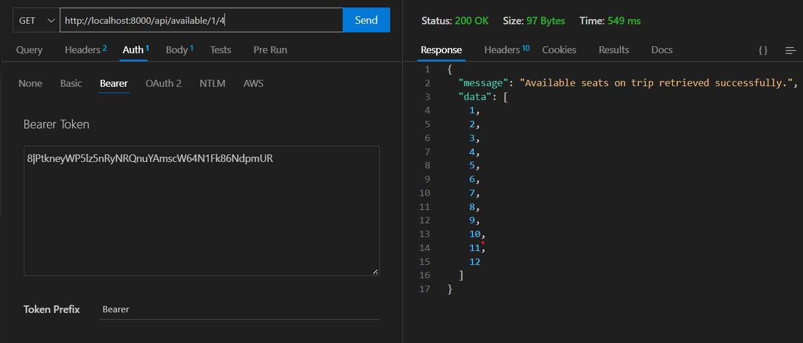
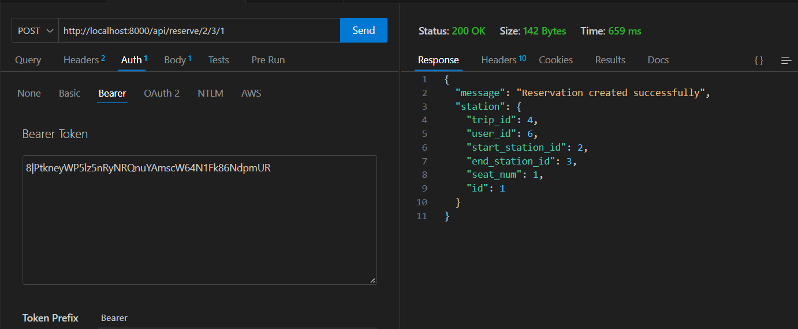
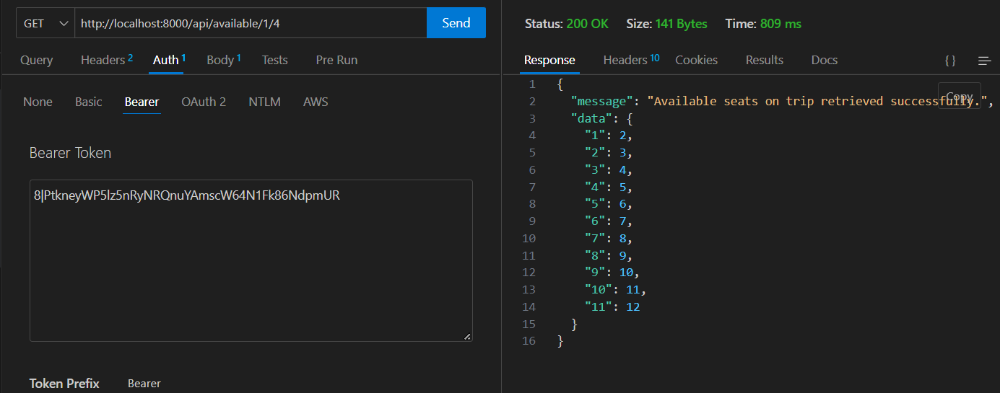

# Bus Fleet System

#### This task requires having composer, php, and mysql cmd integrations to create the database and populate the tables, as well as install the needed dependencies and run them.
#

## Steps to run this project:

1. Download a zipped version of this repo and unzip it in a new folder. Or clone the repo directly.
2. Run the following command in terminal inside the unzipped folder
```shell session
composer install
```
3. In the terminal run the following (enter password for root if needed)
```shell session
mysql -u root -p

CREATE DATABASE bus-fleet CHARACTER SET utf8 COLLATE utf8_unicode_ci;
```
4. Duplicate the `.env.example` and rename it to `.env`
5. In the new `.env` file, you may need to enter the username and password of the MySQL server if you set them up.
6. Back in the terminal, run the following command
```shell session
php artisan migrate:fresh
```
7. To dump the data into the database: In the terminal run the following command. You might need to write the full path to the SQL file.
```sql
mysql -u root -p bus-fleet < bus-dump.sql
```
8. Finally, in the terminal (again) run the following command to run the application
```shell session
php artisan serve
```
#

## Testing the APIs in Thunder Client

#### In the API calls, make sure to add the following header: `accept: application/json`

1. Register a user. For the authentication process I used a combination of Sanctum and Breeze to help ease the process.



2. Login with the same user to obtain the access token used for authenticating the user.



3. Copy the token supplied in the http response. For the first API which retrieves all free seats between 2 stops, the URI is http://localhost:8000/api/available/1/4 where 1:`Cairo` is the start and 4:`Asyut` is the destination. In the Authorization tab in Thunder Client, select Bearer Token and insert the access token into the field. If a wrong token is used, the API call will attempt to redirect to the login screen (Does not exist in our context xD).



4. The second API, which attempts to reserve a seat for a trip between 2 stations, the URI is http://localhost:8000/api/reserve/2/3/1 where the numbers are the start_station_id, end_station_id, seat_num respectively. All this data can be retrieved from the login and available API calls.

For now the data is manually inserted. This call in plain English attempts to book for the authenticated user in a trip containing the start station and end station in their correct order from AlFayyum (2), to AlMinya (3), the seat number 1. Sending the same API call again will return an error that the seats are already booked.




## Admin APIs

#### Implemented a few admin APIs to add trips, stations, and trip_stations.
- You can find the API URIs in the API routes. You can use the following user and authenticated token from login to test them if needed.

```shell session
email: mbAdm@h.com
pass: 12345678
```
